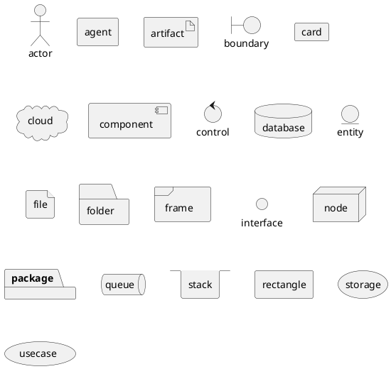

##### [PSR-7 фреймворк 1/7: Структура и работа с HTTP](https://www.youtube.com/watch?v=w4iqxN0nfTs)

Первый урок серии скринкастов по изучению PSR-7 микрофреймворков в PHP. Создание структуры директорий, написание объектов для взаимодействия с HTTP-протоколом и тестирование с помощью PHPUnit.

Обсуждение и исходники: [http://www.elisdn.ru/blog/113/psr7-fr...](https://www.youtube.com/redirect?v=w4iqxN0nfTs&redir_token=UjboSAR2TF274qoFu2aillO2OUR8MTUzODQ2MDQxMkAxNTM4Mzc0MDEy&event=video_description&q=http%3A%2F%2Fwww.elisdn.ru%2Fblog%2F113%2Fpsr7-framework-http)

* Компонентный фреймворк
  * [Фреймворк](https://ru.wikipedia.org/wiki/%D0%A4%D1%80%D0%B5%D0%B9%D0%BC%D0%B2%D0%BE%D1%80%D0%BA)
  * [Библиотеки](https://ru.wikipedia.org/wiki/%D0%91%D0%B8%D0%B1%D0%BB%D0%B8%D0%BE%D1%82%D0%B5%D0%BA%D0%B0_(%D0%BF%D1%80%D0%BE%D0%B3%D1%80%D0%B0%D0%BC%D0%BC%D0%B8%D1%80%D0%BE%D0%B2%D0%B0%D0%BD%D0%B8%D0%B5))
    
- Фрамеворк 
  * проэкт
       * Библиотека 1
       * Библиотека 2
  ```puml
    @startuml
            Фрамеворк -> "Проэкт" : Hello World
            "Библиотека 1" -[#0000FF]-> "Проэкт" : Библиотека 1
            "Библиотека 2"  -[#0000FF]-> "Проэкт" : Библиотека 2
            ' You can also declare: Библиотека 1
            ' "Проэкт" -> Long as "Библиотека 2"
            "Библиотека N"  -[#0000FF]-> "Проэкт" : Библиотека n
    @enduml
```          
            


   // TODO:splaa [Выполнить задачу](https://github.com/SevenPowerX-PHP/ElisDN-Framework/issues/1)
   - Настройка PhpStorm [ссылка](https://stackoverflow.com/questions/21303599/plantuml-and-graphviz-plugin-setup-phpstorm)

```puml
A -> B 
Bob->Alice : hello hello 2
```


```puml
Фрамеворк -> проэкт
Проэкт -> Библиотека1 
```

```plantuml
Bob->Alisa: hello
```
```plantuml
digraph Test {
A -> B
}
```



========================

 - JavaScript
 - JQuery
 - NodeJs
   - npm 
   - Webpack
   
===============
- PHP

`<h1>Data: <?php echo date('Y-m-d') ?></h1>`

Personal Home Page Tools

Hypertext Preprocessor

PHP 4 - OOP

2004 PHP 5.0

5.3

5.4

2012 Composer - Пакетный менеджер

======================
 - Появление ООП в PHP
 - Социальный кодинг GitHub
 - Пакетный менеджер Composer
 =========================
 
 
 

